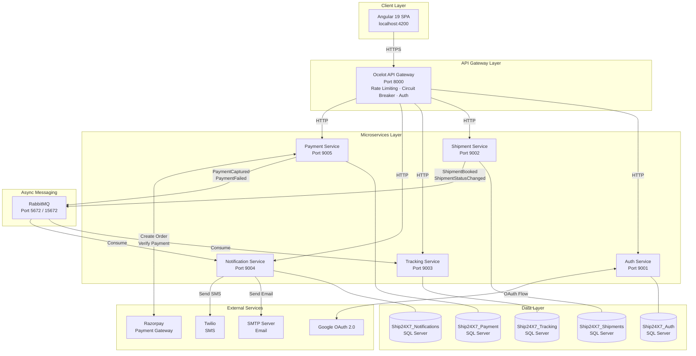
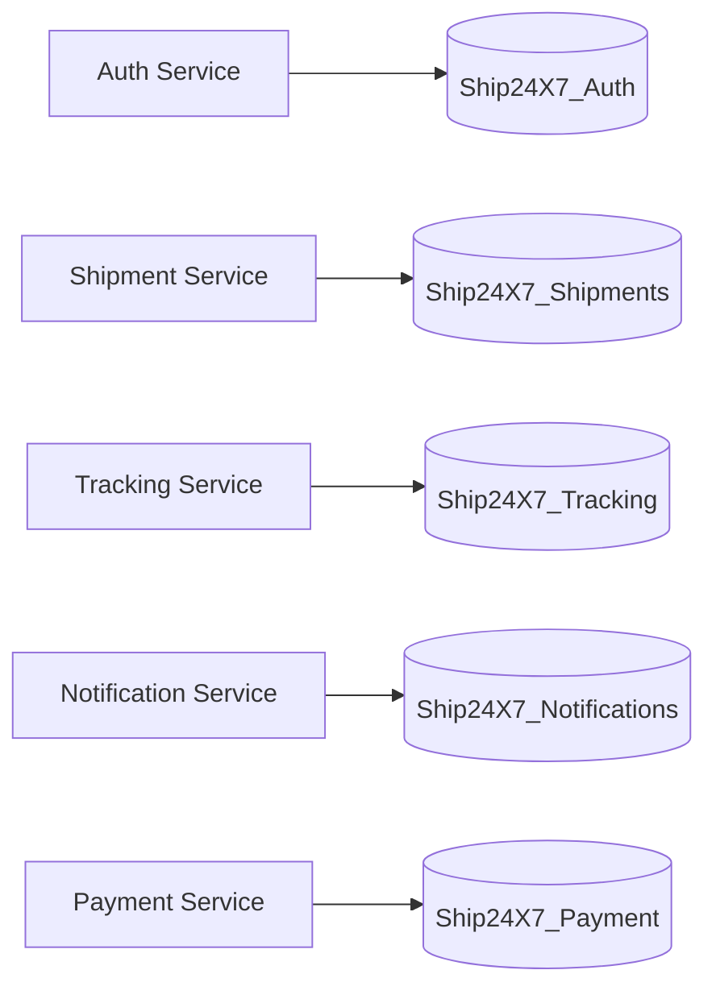
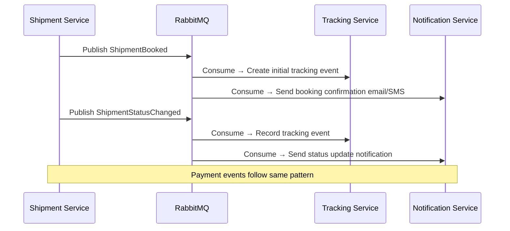
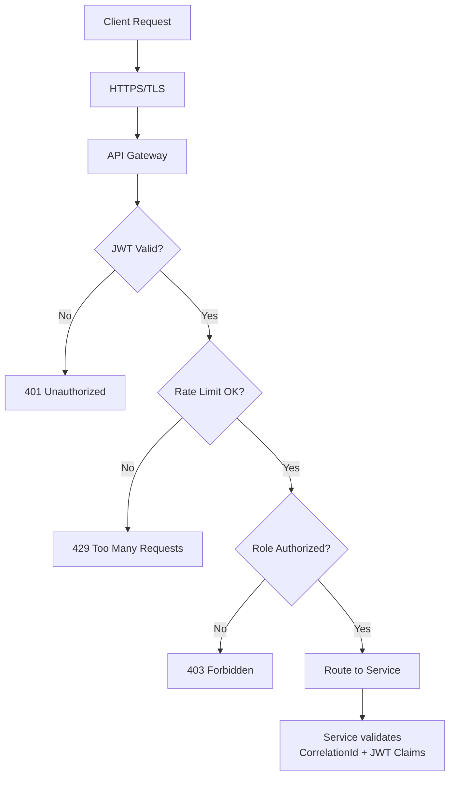
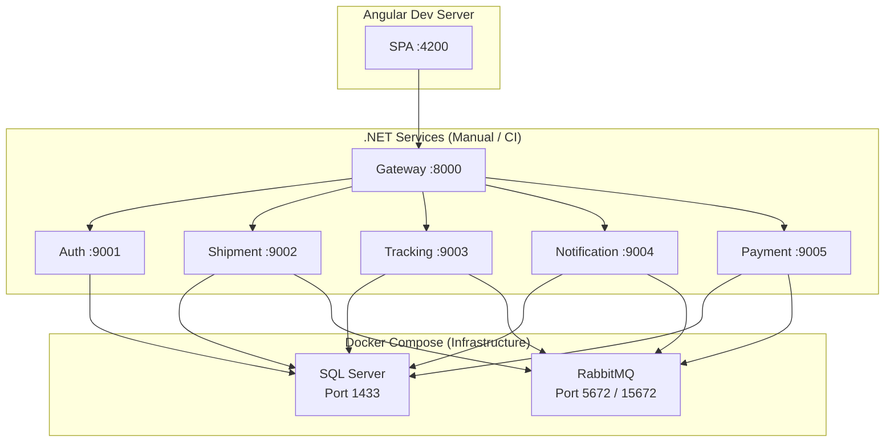

# Ship24X7 — High-Level Design (HLD)

**Version:** 1.0  
**Date:** May 2026  
**Status:** Final

---

## 1. Executive Summary

Ship24X7 is an enterprise-grade, cloud-ready shipping and logistics management platform. It enables customers to book shipments, track parcels in real time, and pay online — while giving operations teams and administrators full visibility and control over the logistics network. The platform is built on a microservices architecture using ASP.NET Core 10.0 on the backend and Angular 19 on the frontend, with Razorpay as the payment gateway and RabbitMQ as the asynchronous message broker.

---

## 2. Business Context

### 2.1 Problem Statement

Traditional logistics platforms suffer from:
- Monolithic architectures that cannot scale individual bottlenecks
- Lack of real-time shipment visibility for customers
- Manual payment reconciliation
- No unified notification layer (email + SMS)
- Poor admin tooling for hub and rate management

### 2.2 Solution

Ship24X7 addresses these by decomposing the domain into independently deployable microservices, each owning its data and communicating asynchronously via events.

### 2.3 Stakeholders

| Stakeholder | Role |
|---|---|
| Customer | Books shipments, tracks parcels, makes payments |
| Hub User | Manages pickups, updates shipment status at hubs |
| Admin User | Manages users, rates, hubs, and shipments |
| System Admin | Full platform access including system configuration |
| Operations Team | Monitors service health and logistics network |

---

## 3. System Architecture Overview

---

## 4. Component Descriptions

### 4.1 Angular SPA (Frontend)

A standalone-component Angular 19 application using signals for reactive state management. It communicates exclusively through the API Gateway and never directly with individual microservices.

**Key modules:**
- Authentication (login, register, MFA, OAuth)
- Shipment Wizard (7-step guided booking)
- Shipment List & Bulk Actions
- Real-time Tracking with Leaflet.js map
- Checkout & Razorpay payment
- Admin Panel (users, hubs, rates, templates)
- Address Book & Settings

### 4.2 API Gateway (Ocelot)

Single entry point for all client requests. Responsibilities:
- **Routing** — maps upstream paths to downstream service endpoints
- **Rate Limiting** — 20–100 req/min per route to prevent abuse
- **Circuit Breaker** — breaks after 5 exceptions, 30-second recovery window
- **Authentication** — validates JWT Bearer tokens on protected routes
- **Correlation ID** — propagates `X-Correlation-Id` header for distributed tracing
- **Swagger Aggregation** — exposes per-service Swagger UIs under `/swagger/{service}/`

### 4.3 Auth Service

Owns all identity and access management:
- JWT access tokens (15-min TTL) + refresh tokens (7-day TTL with rotation)
- TOTP-based MFA
- Google OAuth 2.0
- Email verification via token links
- Role-based access: Customer, Hub_User, Admin_User, System_Admin
- Address book and user preferences storage

### 4.4 Shipment Service

Core business domain service:
- Shipment lifecycle management (Draft → Delivered)
- Service rate catalogue (Standard, Express, Overnight)
- Hub network management
- Pickup scheduling with driver assignment
- Volumetric weight calculation and pricing
- Template system for recurring shipments
- Publishes domain events to RabbitMQ on status changes

### 4.5 Tracking Service

Provides real-time shipment visibility:
- Consumes `ShipmentStatusChanged` events from RabbitMQ
- Records tracking events with location, timestamp, and exception info
- Public API (no auth required) for customer-facing tracking
- Supports exception flagging (delays, missed delivery, customs hold)

### 4.6 Notification Service

Unified notification delivery:
- Consumes events from RabbitMQ (payment captured, shipment booked, delivered)
- Email delivery via SMTP (Gmail, SendGrid, AWS SES)
- SMS delivery via Twilio
- Per-user notification preferences
- Notification history for audit

### 4.7 Payment Service

Handles all financial transactions:
- Creates Razorpay orders with idempotency keys
- Verifies payment signatures (HMAC-SHA256)
- Processes Razorpay webhooks
- Manages refunds
- Payment lifecycle: Pending → Captured/Failed → Refunded

---

## 5. Data Architecture

### 5.1 Database-per-Service Pattern

Each microservice owns its own SQL Server database. No cross-service joins. Data consistency is achieved through eventual consistency via domain events.

### 5.2 Shared Audit Model

All entities inherit from `BaseEntity`:

| Field | Type | Purpose |
|---|---|---|
| CorrelationId | string | Distributed tracing |
| CreatedAt | DateTime | Audit |
| CreatedBy | Guid | Audit |
| UpdatedAt | DateTime? | Audit |
| UpdatedBy | Guid? | Audit |
| IsDeleted | bool | Soft delete |
| DeletedAt | DateTime? | Soft delete audit |
| DeletedBy | Guid? | Soft delete audit |

---

## 6. Communication Patterns

### 6.1 Synchronous (HTTP/REST)

Used for client-facing operations requiring immediate responses:
- All client → Gateway → Service calls
- Payment order creation and verification

### 6.2 Asynchronous (RabbitMQ Events)

Used for cross-service workflows that don't need immediate response:

---

## 7. Security Architecture

**Security controls:**
- JWT with 15-minute expiry limits token theft window
- Refresh token rotation prevents replay attacks
- BCrypt password hashing
- TOTP-based MFA as second factor
- CORS restricted to configured origins
- Rate limiting prevents brute force and DDoS
- Circuit breaker prevents cascade failures
- Idempotency keys prevent duplicate transactions
- Soft delete preserves audit trail

---

## 8. Deployment Architecture

---

## 9. Non-Functional Requirements

| Attribute | Target | Mechanism |
|---|---|---|
| Availability | 99.9% | Circuit breaker, health checks |
| Scalability | Horizontal per service | Independent deployable services |
| Security | OWASP Top 10 compliance | JWT, HTTPS, rate limiting, input validation |
| Observability | Full distributed tracing | Correlation IDs, Serilog structured logs |
| Data Integrity | Eventual consistency | RabbitMQ events, idempotency keys |
| Performance | < 500ms p95 API response | Rate limiting, connection pooling |
| Auditability | Full audit trail | BaseEntity soft delete + audit fields |

---

## 10. Technology Stack Summary

| Layer | Technology |
|---|---|
| Frontend | Angular 19, TypeScript, Tailwind CSS, Leaflet.js |
| API Gateway | ASP.NET Core 10, Ocelot |
| Microservices | ASP.NET Core 10, C# |
| ORM | Entity Framework Core |
| Database | Microsoft SQL Server |
| Message Broker | RabbitMQ |
| Payment | Razorpay |
| Email | SMTP (Gmail / SendGrid / AWS SES) |
| SMS | Twilio |
| Auth | JWT, Google OAuth 2.0, TOTP MFA |
| Logging | Serilog (structured, rolling file) |
| Containerization | Docker Compose |
