# Ship24X7 — Low-Level Design (LLD)

**Version:** 1.0  
**Date:** May 2026  
**Status:** Final

---

## 1. Introduction

This document describes the internal design of each microservice, data models, API contracts, class relationships, and key algorithms in the Ship24X7 platform.

---

## 2. Shared Infrastructure

### 2.1 BaseEntity

All domain entities inherit from `BaseEntity` in `Ship24X7.Shared`.

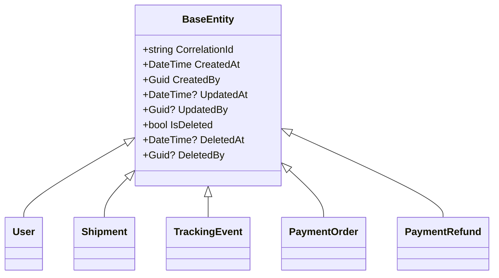

### 2.2 CorrelationIdMiddleware

Registered in every service's ASP.NET pipeline. Extracts `X-Correlation-Id` from the incoming request header or generates a new GUID. Pushes it to:
1. Response headers (for client-side tracing)
2. Serilog `LogContext` (for log enrichment)
3. `HttpContext.Items["CorrelationId"]` (for service layer access)

### 2.3 Serilog Configuration

- Console sink for development
- Daily rolling file sink: 30-day retention, 100 MB per file
- Enriched with `CorrelationId`, `ServiceName`, `Environment`

---

## 3. Auth Service

### 3.1 Domain Model

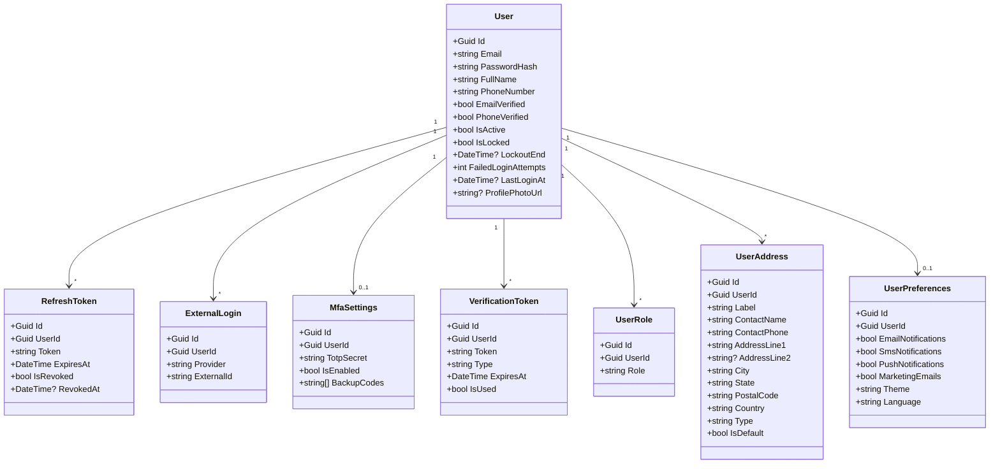

### 3.2 Authentication Flow

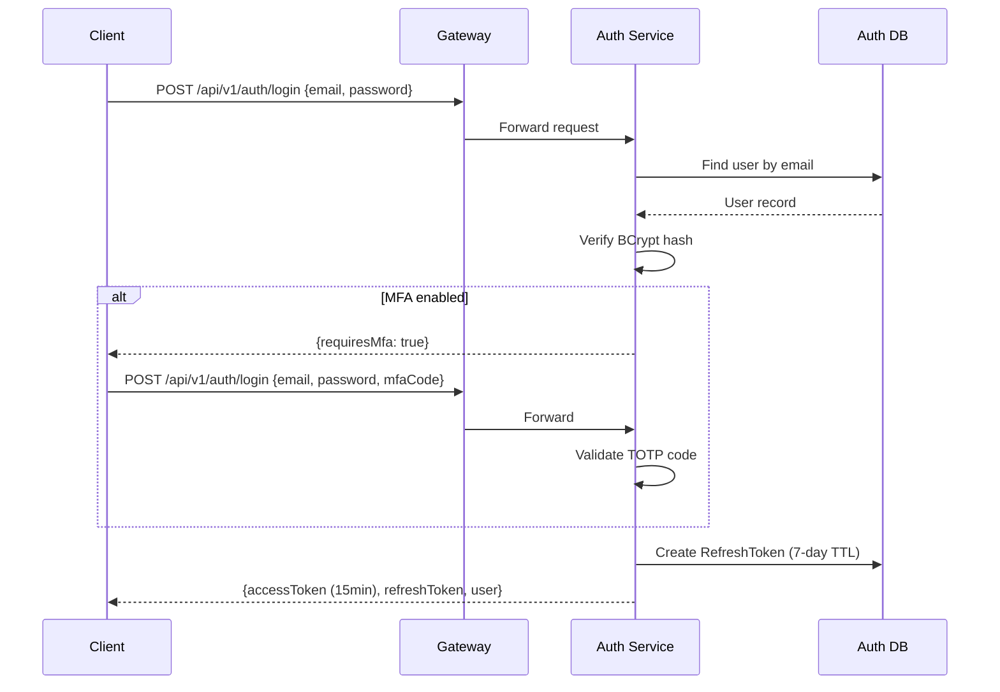

### 3.3 Token Refresh Flow

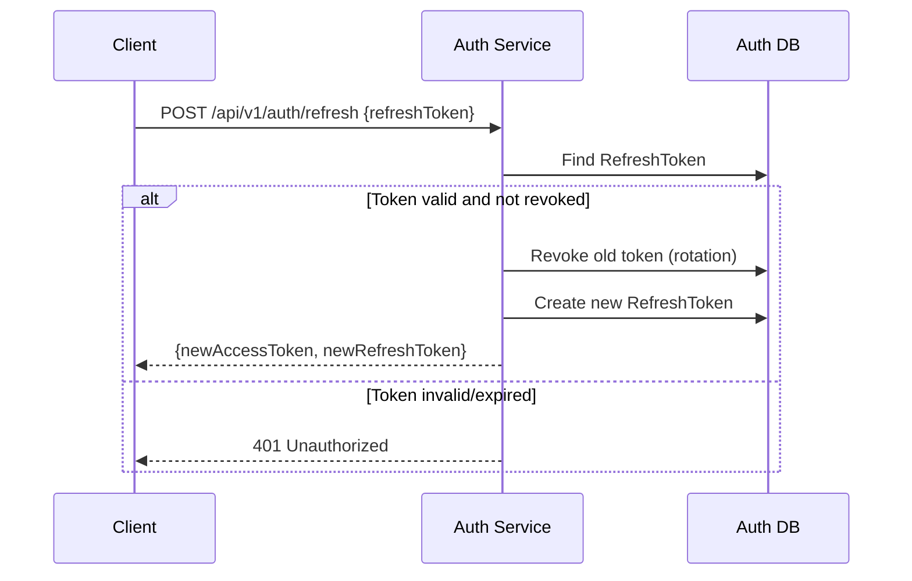

### 3.4 Google OAuth Flow

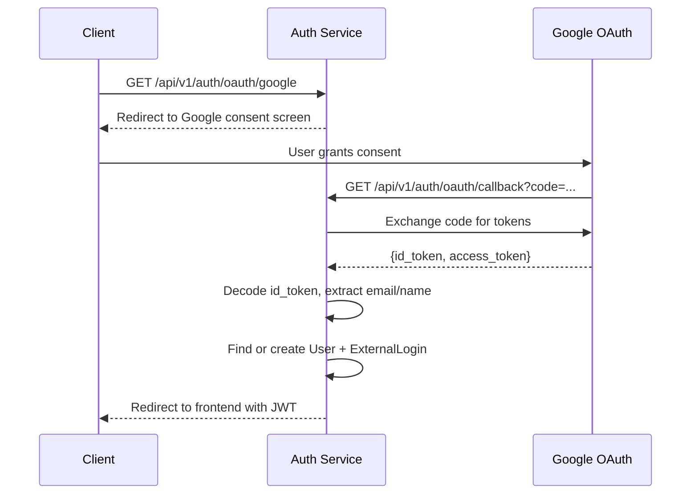

### 3.5 API Endpoints

| Method | Path | Auth | Description |
|---|---|---|---|
| POST | /api/v1/auth/register | None | Register new user |
| POST | /api/v1/auth/login | None | Login with email/password |
| POST | /api/v1/auth/refresh | None | Refresh access token |
| POST | /api/v1/auth/logout | Bearer | Revoke refresh token |
| GET | /api/v1/auth/me | Bearer | Get current user |
| PUT | /api/v1/auth/me | Bearer | Update profile |
| PUT | /api/v1/auth/me/password | Bearer | Change password |
| GET | /api/v1/auth/verify-email | None | Verify email token |
| POST | /api/v1/auth/mfa/setup | Bearer | Setup TOTP MFA |
| POST | /api/v1/auth/mfa/verify | Bearer | Verify MFA code |
| POST | /api/v1/auth/mfa/disable | Bearer | Disable MFA |
| GET | /api/v1/auth/addresses | Bearer | Get address book |
| POST | /api/v1/auth/addresses | Bearer | Save address |
| PUT | /api/v1/auth/addresses/{id} | Bearer | Update address |
| DELETE | /api/v1/auth/addresses/{id} | Bearer | Delete address |
| GET | /api/v1/auth/preferences | Bearer | Get preferences |
| PUT | /api/v1/auth/preferences | Bearer | Update preferences |
| GET | /api/v1/auth/users | Admin | List all users |
| POST | /api/v1/auth/users/{id}/activate | Admin | Activate user |
| POST | /api/v1/auth/users/{id}/deactivate | Admin | Deactivate user |

---

## 4. Shipment Service

### 4.1 Domain Model

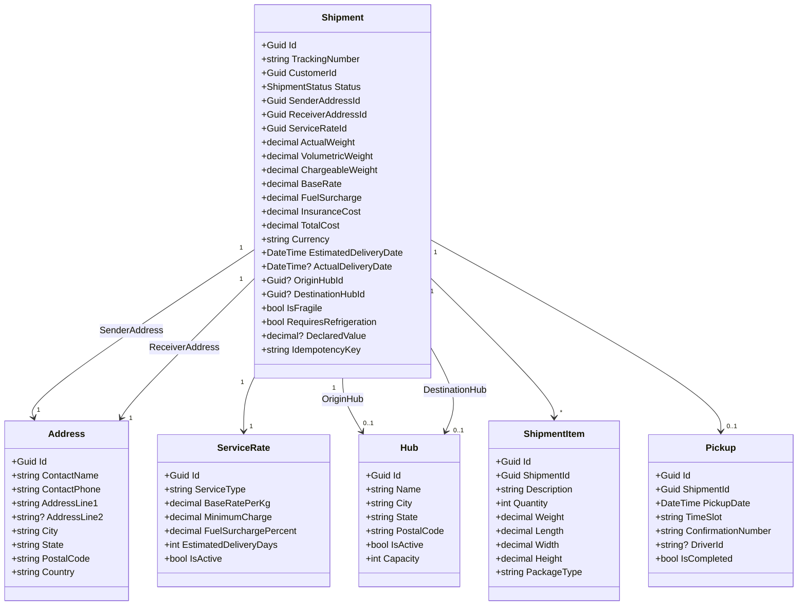

### 4.2 Shipment Status State Machine

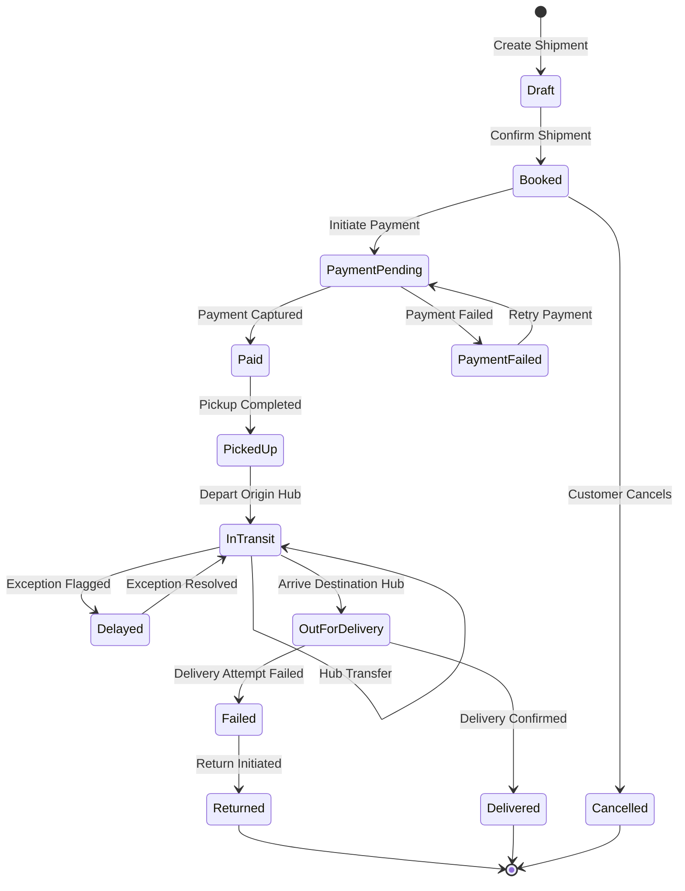

### 4.3 Pricing Algorithm

```
VolumetricWeight = (Length × Width × Height) / 5000
ChargeableWeight = MAX(ActualWeight, VolumetricWeight)
BaseRate = MAX(ChargeableWeight × ServiceRate.BaseRatePerKg, ServiceRate.MinimumCharge)
FuelSurcharge = BaseRate × ServiceRate.FuelSurchargePercent / 100
InsuranceCost = DeclaredValue × 0.01  (if insurance selected)
TotalCost = BaseRate + FuelSurcharge + InsuranceCost
```

### 4.4 Tracking Number Format

```
SHIP24X7-YYYYMMDDNNNNNN
Example: SHIP24X7-20260504000001
```

### 4.5 API Endpoints

| Method | Path | Auth | Description |
|---|---|---|---|
| POST | /api/v1/shipment/shipments | Bearer | Create shipment |
| GET | /api/v1/shipment/shipments | Bearer | List shipments |
| GET | /api/v1/shipment/shipments/{id} | Bearer | Get shipment |
| GET | /api/v1/shipment/shipments/tracking/{num} | Bearer | Get by tracking number |
| POST | /api/v1/shipment/shipments/{id}/confirm | Bearer | Confirm shipment |
| POST | /api/v1/shipment/shipments/{id}/status | Admin | Update status |
| POST | /api/v1/shipment/shipments/{id}/pickup | Bearer | Schedule pickup |
| POST | /api/v1/shipment/shipments/{id}/pickup/complete | Hub | Complete pickup |
| POST | /api/v1/shipment/shipments/bulk-archive | Bearer | Bulk archive |
| GET | /api/v1/shipment/dashboard/summary | Bearer | Dashboard stats |
| GET | /api/v1/Rate | Bearer | Get service rates |
| GET | /api/v1/shipment/hubs | Admin | List hubs |
| GET | /api/v1/shipment/templates | Bearer | List templates |
| POST | /api/v1/shipment/templates | Bearer | Create template |

---

## 5. Tracking Service

### 5.1 Domain Model

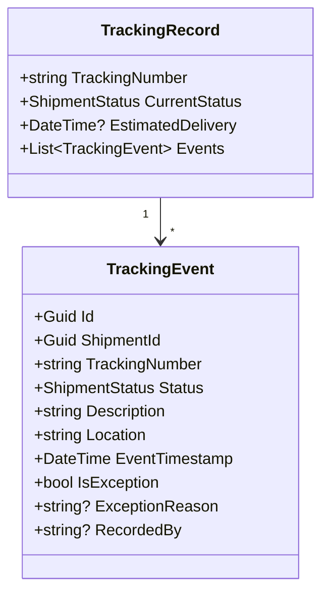

### 5.2 Event Consumption Flow

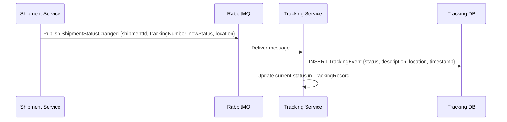

### 5.3 API Endpoints

| Method | Path | Auth | Description |
|---|---|---|---|
| GET | /api/v1/tracking/{trackingNumber} | None | Get tracking info |
| POST | /api/v1/tracking/events | Internal | Record tracking event |

---

## 6. Payment Service

### 6.1 Domain Model

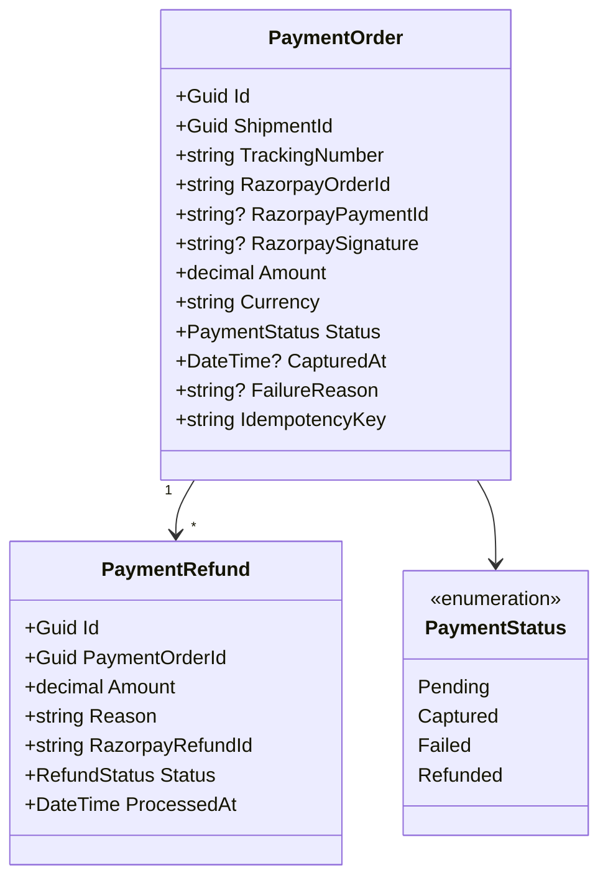

### 6.2 Payment Flow

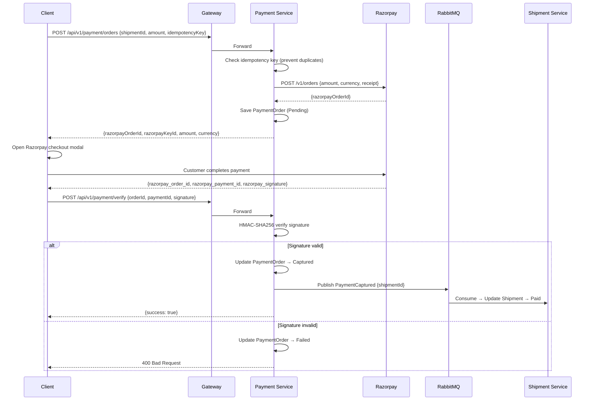

### 6.3 Signature Verification Algorithm

```
expectedSignature = HMAC-SHA256(razorpayOrderId + "|" + razorpayPaymentId, razorpayKeySecret)
isValid = (expectedSignature == razorpaySignature)
```

### 6.4 API Endpoints

| Method | Path | Auth | Description |
|---|---|---|---|
| POST | /api/v1/payment/orders | Bearer | Create payment order |
| POST | /api/v1/payment/verify | Bearer | Verify payment |
| GET | /api/v1/payment/shipments/{id} | Bearer | Get payments for shipment |
| POST | /api/v1/payment/webhook | None (HMAC) | Razorpay webhook |
| POST | /api/v1/payment/refund | Admin | Process refund |

---

## 7. Notification Service

### 7.1 Event Handlers

| Event | Action |
|---|---|
| ShipmentBooked | Email + SMS booking confirmation |
| PaymentCaptured | Email payment receipt |
| PaymentFailed | Email payment failure alert |
| ShipmentPickedUp | SMS pickup confirmation |
| ShipmentInTransit | Email in-transit update |
| ShipmentOutForDelivery | SMS out-for-delivery alert |
| ShipmentDelivered | Email + SMS delivery confirmation |
| ShipmentDelayed | Email delay notification |

### 7.2 Notification Delivery Flow

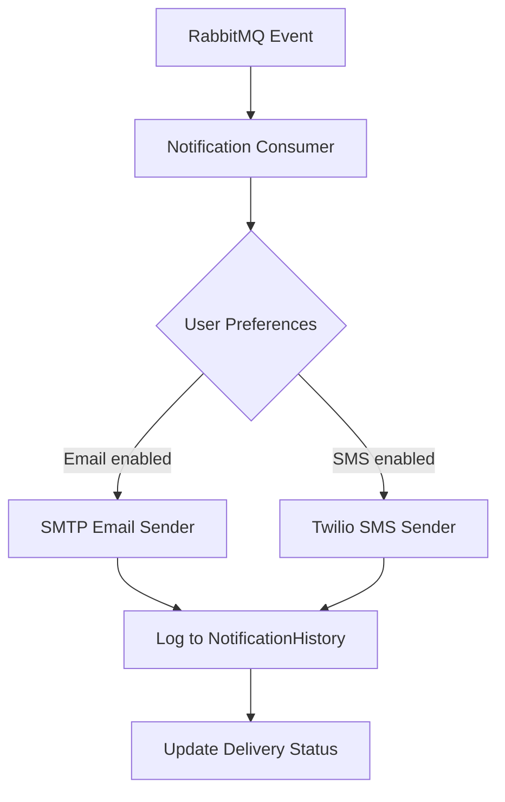

---

## 8. API Gateway — Routing Configuration

### 8.1 Route Map

| Upstream Path | Downstream Service | Port | Rate Limit |
|---|---|---|---|
| /api/v1/auth/** | Auth Service | 9001 | 20 req/min |
| /api/v1/shipment/** | Shipment Service | 9002 | 60 req/min |
| /api/v1/tracking/** | Tracking Service | 9003 | 100 req/min |
| /api/v1/notification/** | Notification Service | 9004 | 30 req/min |
| /api/v1/payment/** | Payment Service | 9005 | 20 req/min |

### 8.2 Circuit Breaker Configuration

```json
{
  "ExceptionsAllowedBeforeBreaking": 5,
  "DurationOfBreak": 30000,
  "TimeoutValue": 10000
}
```

---

## 9. Frontend Architecture

### 9.1 Angular Application Structure

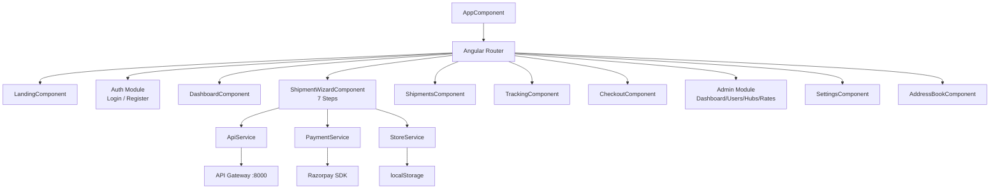

### 9.2 State Management (StoreService Signals)

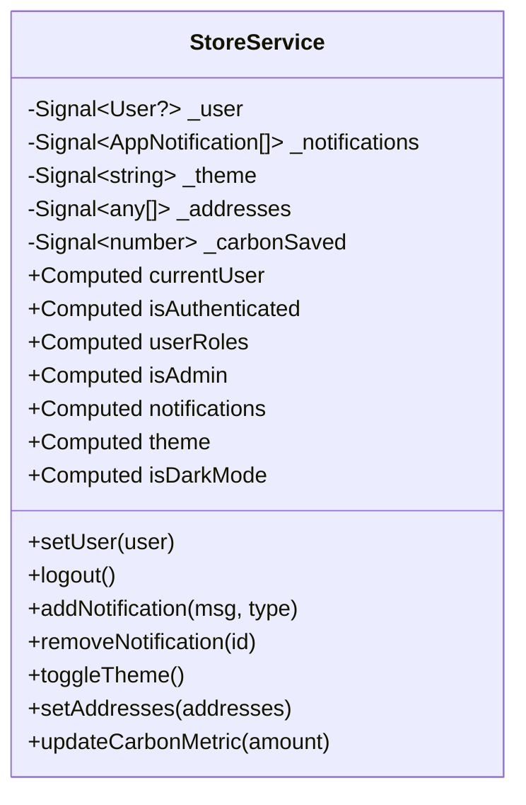

### 9.3 Shipment Wizard Steps

| Step | Form | Key Fields |
|---|---|---|
| 1 | originForm | senderName, senderEmail, senderPhone, senderAddress, city, state, postalCode |
| 2 | destForm | receiverName, receiverEmail, receiverPhone, receiverAddress, city, state, postalCode |
| 3 | packageForm | weight, length, width, height, type |
| 4 | serviceForm | serviceId (Standard / Express / Overnight) |
| 5 | addonsForm | insurance, carbonOffset, fragile, signature |
| 6 | billingForm | paymentMethod, promoCode |
| 7 | — | Confirmation, label generation, payment |

### 9.4 HTTP Interceptors

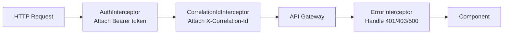

### 9.5 Route Guards

| Guard | Condition | Redirect |
|---|---|---|
| authGuard | User must be authenticated | /login |
| noAuthGuard | User must NOT be authenticated | /dashboard |
| roleGuard | User must have specified role | /dashboard |

---

## 10. Database Schema Details

### 10.1 Auth Database — Key Tables

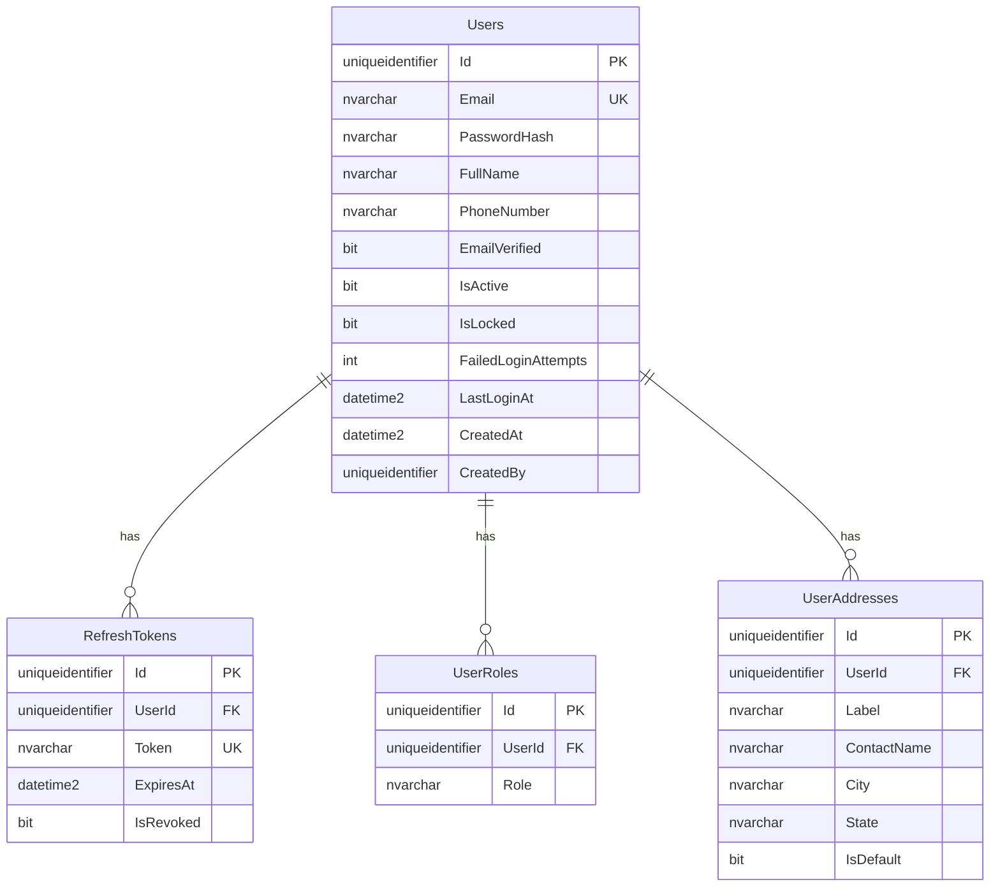

### 10.2 Shipment Database — Key Tables

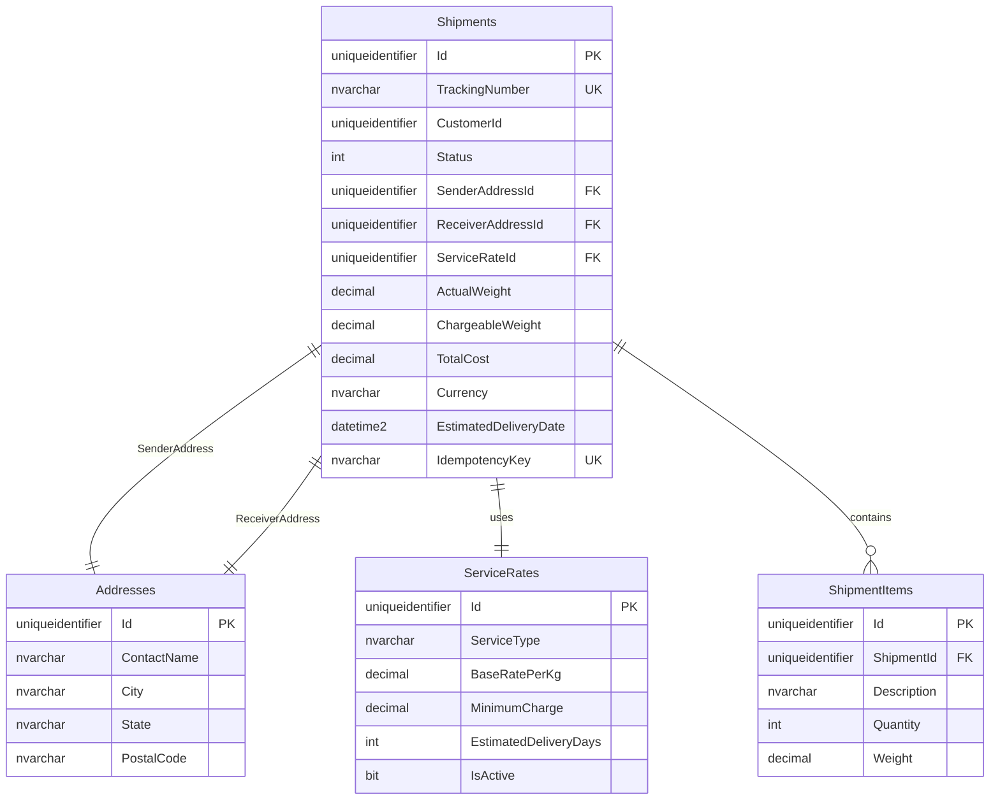

### 10.3 Payment Database — Key Tables

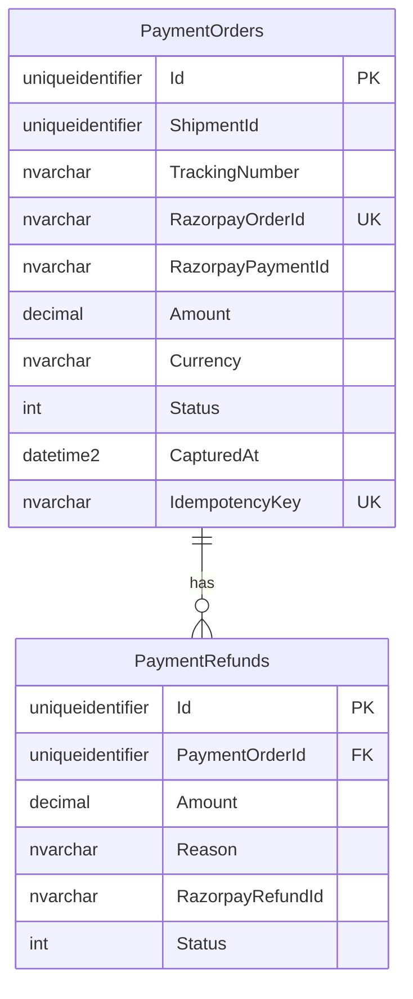

---

## 11. Error Handling Strategy

| Layer | Mechanism |
|---|---|
| Frontend | ErrorInterceptor catches HTTP errors, StoreService shows toast notifications |
| Gateway | Returns 4xx/5xx with structured error body |
| Services | Global exception middleware returns `{error: "message"}` JSON |
| Domain | Domain exceptions for business rule violations |
| Infrastructure | EF Core retry policies for transient DB failures |
| Messaging | Dead-letter queues for failed RabbitMQ message processing |
