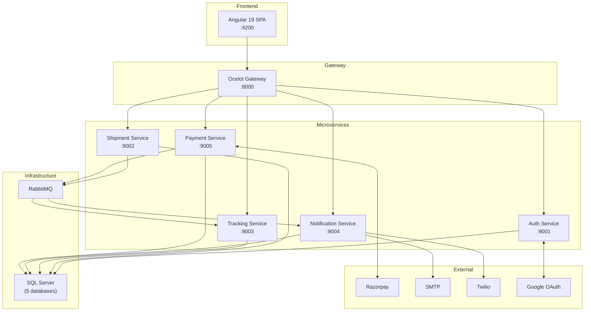
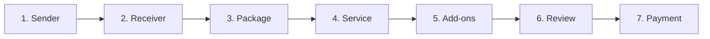
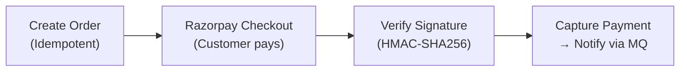
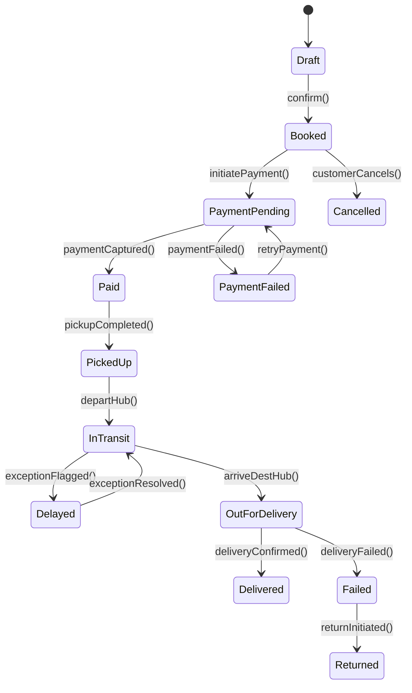
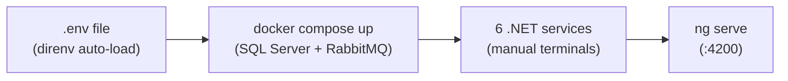
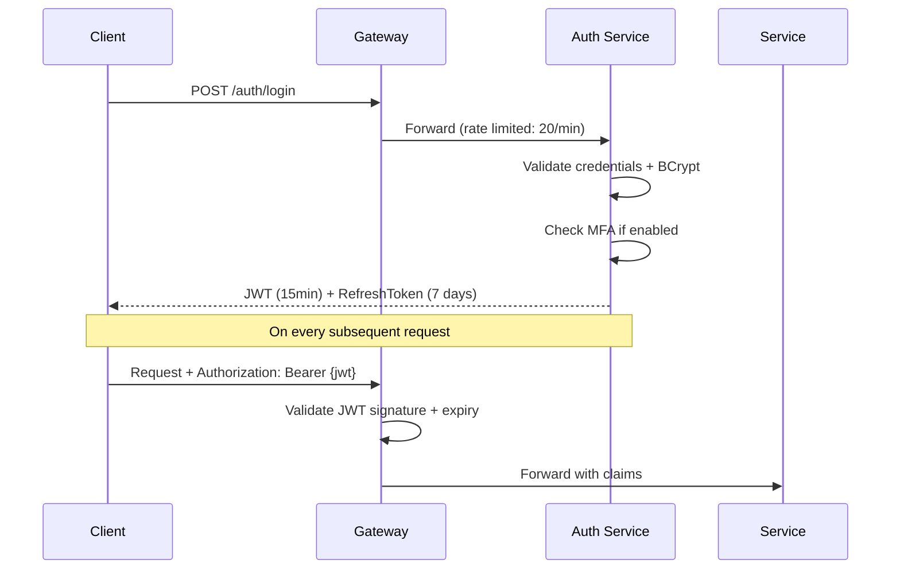

# Ship24x7 — Project Report

---

## 1. Project Overview

### 1.1 Project Name
**Ship24x7** — Shipping & Logistics Management Platform

### 1.2 Project Summary

Ship24x7 is a full-stack, logistics platform that enables businesses and individuals to book, pay for, and track shipments across India. The platform is built on a microservices architecture using ASP.NET Core 10.0 on the backend and Angular 19 on the frontend, with Razorpay as the integrated payment gateway.

The name "Ship24x7" reflects the platform's core promise: shipping services available 24 hours a day, 7 days a week.

### 1.3 Project Objectives

1. Build a scalable, independently deployable microservices platform for logistics management
2. Provide customers with a seamless, guided shipment booking experience
3. Enable real-time shipment tracking with map visualization
4. Integrate a secure, idempotent payment flow via Razorpay
5. Deliver a comprehensive admin panel for operations management
6. Implement enterprise-grade security (JWT, MFA, OAuth, RBAC)
7. Establish observability through structured logging and distributed tracing

---

## 2. Scope

### 2.1 In Scope

- Customer registration, login, MFA, and Google OAuth
- 7-step guided shipment booking wizard
- Service rate management (Standard, Express, Overnight)
- Razorpay payment integration with signature verification
- Real-time shipment tracking with Leaflet.js map
- Hub network management
- Pickup scheduling and driver assignment
- Email (SMTP) and SMS (Twilio) notifications
- Admin panel: users, hubs, rates, shipments, templates
- Address book and user preferences
- Bulk shipment operations (archive)
- Shipment templates for recurring bookings
- Health check endpoints for all services
- Correlation ID-based distributed tracing

### 2.2 Out of Scope

- Mobile native applications (iOS/Android)
- International shipments (multi-currency beyond INR)
- Third-party carrier integrations (FedEx, DHL, etc.)
- Real-time GPS tracking of delivery vehicles
- Warehouse management system (WMS)
- Customer support ticketing system

---

## 3. System Architecture

### 3.1 Architecture Style

The platform follows a **microservices architecture** with the following key principles:

- **Single Responsibility**: Each service owns one bounded context
- **Database per Service**: No shared databases; data consistency via events
- **API Gateway Pattern**: Single entry point for all client traffic
- **Event-Driven Communication**: RabbitMQ for async cross-service workflows
- **Domain-Driven Design**: Rich domain models with business logic encapsulated in entities

### 3.2 Service Topology



### 3.3 Clean Architecture per Service

Each microservice follows Clean Architecture with four layers:

```
Service/
├── API/           → Controllers, Middleware, Program.cs
├── Application/   → Use Cases, DTOs, Interfaces
├── Domain/        → Entities, Enums, Business Rules
└── Infrastructure → EF Core, Repositories, External Clients
```

---

## 4. Key Features

### 4.1 Authentication & Security

| Feature | Implementation |
|---|---|
| Password Authentication | BCrypt hashing, lockout after 5 failed attempts |
| JWT Tokens | 15-min access token, 7-day refresh token with rotation |
| Multi-Factor Authentication | TOTP (Time-based One-Time Password) |
| Social Login | Google OAuth 2.0 |
| Email Verification | Token-based verification link via email |
| Role-Based Access Control | Customer, Hub_User, Admin_User, System_Admin |
| Distributed Tracing | X-Correlation-Id header propagated across all services |

### 4.2 Shipment Booking

The 7-step wizard guides users through the complete booking process:



**Pricing Model:**
- Volumetric weight = (L × W × H) / 5000
- Chargeable weight = MAX(actual, volumetric)
- Total = Base Rate + Fuel Surcharge + Insurance + GST (18%)

### 4.3 Payment Processing



Payment statuses: `Pending → Captured → Refunded` or `Pending → Failed`

### 4.4 Real-Time Tracking

- Public endpoint (no authentication required)
- Full event timeline with status, location, and timestamp
- Exception flagging for delays, missed deliveries, customs holds
- Interactive map (Leaflet.js) with dark/light theme support
- Tracking number format: `SHIP24X7-YYYYMMDDNNNNNN`

### 4.5 Notification System

| Trigger | Email | SMS |
|---|---|---|
| Shipment Booked | ✓ | ✓ |
| Payment Captured | ✓ | — |
| Pickup Confirmed | — | ✓ |
| In Transit | ✓ | — |
| Out for Delivery | — | ✓ |
| Delivered | ✓ | ✓ |
| Delayed | ✓ | — |

---

## 5. Data Models

### 5.1 Core Entities

| Entity | Service | Key Fields |
|---|---|---|
| User | Auth | Id, Email, PasswordHash, Roles, MfaSettings |
| Shipment | Shipment | Id, TrackingNumber, Status, Addresses, TotalCost |
| TrackingEvent | Tracking | Id, ShipmentId, Status, Location, EventTimestamp |
| PaymentOrder | Payment | Id, ShipmentId, RazorpayOrderId, Amount, Status |
| Hub | Shipment | Id, Name, City, Capacity |
| ServiceRate | Shipment | Id, ServiceType, BaseRatePerKg, EstimatedDeliveryDays |

### 5.2 Shipment Lifecycle



---

## 6. API Design

### 6.1 Gateway Routes Summary

| Service | Base Path | Auth Required |
|---|---|---|
| Auth | /api/v1/auth/** | Varies |
| Shipment | /api/v1/shipment/** | Bearer |
| Tracking | /api/v1/tracking/** | None (public) |
| Notification | /api/v1/notification/** | Bearer |
| Payment | /api/v1/payment/** | Bearer |

### 6.2 Rate Limiting

| Route | Limit | Window |
|---|---|---|
| Auth endpoints | 20 req | 1 minute |
| Payment endpoints | 20 req | 1 minute |
| Notification endpoints | 30 req | 1 minute |
| Shipment endpoints | 60 req | 1 minute |
| Tracking endpoints | 100 req | 1 minute |

### 6.3 Circuit Breaker

- Threshold: 5 consecutive exceptions
- Break duration: 30 seconds
- Timeout per request: 10 seconds

---

## 7. Frontend Architecture

### 7.1 Technology Choices

| Choice | Rationale |
|---|---|
| Angular 19 Standalone Components | Eliminates NgModule boilerplate; better tree-shaking |
| Angular Signals | Fine-grained reactivity without Zone.js overhead |
| Tailwind CSS | Utility-first CSS for rapid, consistent UI development |
| Leaflet.js | Lightweight, open-source map library |
| Reactive Forms | Type-safe form handling with built-in validation |

### 7.2 Application State

The `StoreService` manages global state using Angular signals:
- Current authenticated user
- Toast notifications (auto-dismiss after 5 seconds)
- Theme (light/dark, persisted to DOM)
- Saved addresses
- Carbon offset metrics

### 7.3 Route Structure

```
/                    → Landing (public)
/login               → Login (no-auth guard)
/register            → Register (no-auth guard)
/dashboard           → Customer dashboard (auth guard)
/shipments           → Shipment list (auth guard)
/new-shipment        → Booking wizard (auth guard)
/track               → Public tracking
/track/:number       → Tracking by number
/checkout            → Payment checkout (auth guard)
/address-book        → Address management (auth guard)
/settings            → User settings (auth guard)
/admin               → Admin dashboard (admin role guard)
/admin/shipments     → Admin shipment management
/admin/users         → User management
/admin/hubs          → Hub management
/admin/rates         → Rate management
/admin/templates     → Template management
/rates               → Public rates page
/contact             → Contact/support
```

---

## 8. Infrastructure & DevOps

### 8.1 Local Development Setup



### 8.2 Database Management

- EF Core Code-First migrations per service
- Each service runs `dotnet ef database update` independently
- No shared schema; cross-service data via API calls or events

### 8.3 Health Checks

All services expose `/health` endpoints. The Gateway aggregates health status. The Angular navbar polls `/auth/health` every 5 minutes to show "Network Live / Offline" status.

### 8.4 Logging

- Serilog structured logging in all services
- Daily rolling log files (30-day retention, 100 MB/file)
- CorrelationId enriched in every log entry
- Log format: JSON for production, console for development

---

## 9. Security Implementation

### 9.1 Authentication Flow



### 9.2 Security Controls Summary

| Control | Implementation |
|---|---|
| Password Storage | BCrypt with salt |
| Token Expiry | 15-minute JWT access tokens |
| Token Rotation | Refresh token invalidated on use |
| MFA | TOTP (RFC 6238) |
| Social Auth | Google OAuth 2.0 (PKCE) |
| Transport Security | HTTPS/TLS (dev cert for local) |
| CORS | Restricted to configured origins |
| Rate Limiting | Per-route limits at gateway |
| Idempotency | UUID keys prevent duplicate transactions |
| Audit Trail | BaseEntity soft delete + full audit fields |
| Secrets Management | .env file (never committed); production: Azure Key Vault / AWS Secrets Manager |

---

## 10. Testing

### 10.1 Test Projects

Each service has a dedicated test project:

| Project | Type |
|---|---|
| Ship24X7.Gateway.Tests | Integration, Health Check |
| Ship24X7.Auth.Tests | Unit, Integration |
| Ship24X7.Shipment.Tests | Unit, Integration |
| Ship24X7.Tracking.Tests | Unit |
| Ship24X7.Notification.Tests | Unit |
| Ship24X7.Payment.Tests | Unit, Integration |

### 10.2 Test Coverage Areas

- Gateway routing configuration validation
- Gateway integration tests (route forwarding)
- Health check endpoint tests
- Auth service: login, registration, token refresh, MFA
- Shipment service: creation, pricing calculation, status transitions
- Payment service: order creation, signature verification, idempotency
- Tracking service: event recording, public query

---

## 11. Known Limitations & Future Enhancements

### 11.1 Current Limitations

| Area | Limitation |
|---|---|
| Checkout | Multi-shipment batch payment processes only the first shipment |
| Tracking Map | Map shows static origin/destination; no live GPS tracking |
| Currency | Only INR supported (Razorpay INR) |
| Notifications | No push notifications (web/mobile) |
| Storage | Local file storage only (no cloud blob storage yet) |

### 11.2 Planned Enhancements

| Enhancement | Priority |
|---|---|
| Multi-shipment batch payment | High |
| Live GPS tracking via WebSockets | High |
| Mobile app (React Native) | Medium |
| Azure Blob Storage for labels/documents | Medium |
| International shipping with multi-currency | Medium |
| Third-party carrier API integrations | Low |
| Customer support chat | Low |
| AI-powered delivery time prediction | Low |

---

## 12. Project Metrics

| Metric | Value |
|---|---|
| Backend Services | 6 (5 microservices + 1 gateway) |
| Frontend Components | 30+ standalone Angular components |
| API Endpoints | 50+ REST endpoints |
| Database Tables | 25+ across 5 databases |
| Shipment Statuses | 13 distinct states |
| Payment Statuses | 4 states |
| User Roles | 4 (Customer, Hub_User, Admin_User, System_Admin) |
| External Integrations | 4 (Razorpay, Twilio, SMTP, Google OAuth) |
| Test Projects | 6 |

---

## 13. Glossary

| Term | Definition |
|---|---|
| Chargeable Weight | MAX(actual weight, volumetric weight) used for pricing |
| Correlation ID | UUID propagated across all service calls for distributed tracing |
| Idempotency Key | UUID that prevents duplicate shipment/payment creation on retry |
| Soft Delete | Marking records as deleted without removing from database |
| Circuit Breaker | Pattern that stops forwarding requests to a failing service |
| TOTP | Time-based One-Time Password for MFA |
| Volumetric Weight | (L × W × H) / 5000 — dimensional weight for pricing |
| Hub | Physical logistics facility where shipments are sorted and transferred |
| Tracking Event | A recorded status change in a shipment's journey |
| Dead Letter Queue | RabbitMQ queue for messages that failed processing |

---

## 14. References

- [ASP.NET Core 10 Documentation](https://learn.microsoft.com/en-us/aspnet/core/)
- [Angular 19 Documentation](https://angular.dev/)
- [Ocelot API Gateway](https://ocelot.readthedocs.io/)
- [Razorpay API Reference](https://razorpay.com/docs/api/)
- [RabbitMQ Documentation](https://www.rabbitmq.com/documentation.html)
- [Twilio SMS API](https://www.twilio.com/docs/sms)
- [Leaflet.js Documentation](https://leafletjs.com/reference.html)
- [Serilog Documentation](https://serilog.net/)
