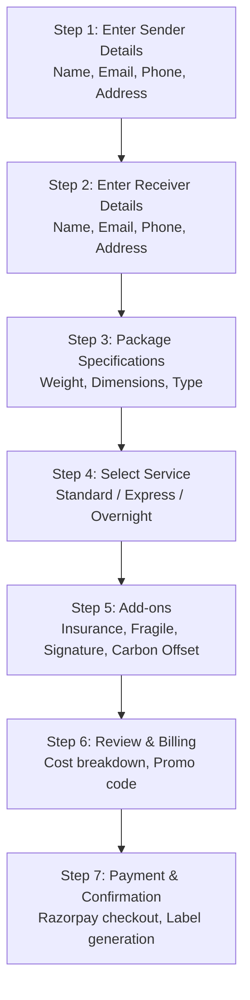
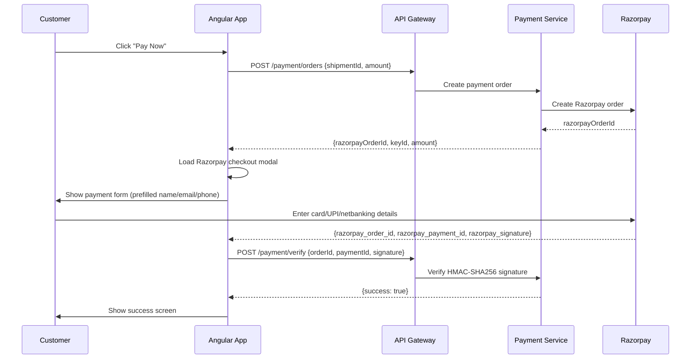

# Ship24X7 — Use Case Document

**Version:** 1.0  
**Date:** May 2026  
**Status:** Final

---

## 1. Actors

| Actor | Description |
|---|---|
| **Customer** | Registered user who books and tracks shipments |
| **Guest** | Unauthenticated visitor who can track shipments publicly |
| **Hub User** | Logistics staff at a physical hub who updates shipment status |
| **Admin User** | Operations manager with access to admin panel |
| **System Admin** | Full platform access including system configuration |
| **Razorpay** | External payment gateway (system actor) |
| **Notification System** | Internal system actor that sends emails and SMS |

---

## 2. Use Case Diagram

```mermaid
graph TD
    subgraph Actors
        GUEST["👤 Guest"]
        CUST["👤 Customer"]
        HUB["👤 Hub User"]
        ADMIN["👤 Admin User"]
        SYSADMIN["👤 System Admin"]
    end

    subgraph Authentication
        UC1["UC-01: Register Account"]
        UC2["UC-02: Login"]
        UC3["UC-03: Google OAuth Login"]
        UC4["UC-04: Setup MFA"]
        UC5["UC-05: Verify Email"]
        UC6["UC-06: Logout"]
    end

    subgraph Shipment_Management
        UC7["UC-07: Book Shipment"]
        UC8["UC-08: View Shipments"]
        UC9["UC-09: Archive Shipments"]
        UC10["UC-10: Schedule Pickup"]
        UC11["UC-11: Use Shipment Template"]
    end

    subgraph Tracking
        UC12["UC-12: Track Shipment (Public)"]
        UC13["UC-13: View Tracking Map"]
        UC14["UC-14: Record Tracking Event"]
    end

    subgraph Payment
        UC15["UC-15: Pay for Shipment"]
        UC16["UC-16: View Payment History"]
        UC17["UC-17: Request Refund"]
    end

    subgraph Profile
        UC18["UC-18: Manage Address Book"]
        UC19["UC-19: Update Profile"]
        UC20["UC-20: Change Password"]
        UC21["UC-21: Set Notification Preferences"]
    end

    subgraph Admin
        UC22["UC-22: Manage Users"]
        UC23["UC-23: Manage Hubs"]
        UC24["UC-24: Manage Service Rates"]
        UC25["UC-25: View All Shipments"]
        UC26["UC-26: Update Shipment Status"]
        UC27["UC-27: Manage Templates"]
    end

    GUEST --> UC12
    CUST --> UC1
    CUST --> UC2
    CUST --> UC3
    CUST --> UC4
    CUST --> UC5
    CUST --> UC6
    CUST --> UC7
    CUST --> UC8
    CUST --> UC9
    CUST --> UC10
    CUST --> UC11
    CUST --> UC12
    CUST --> UC13
    CUST --> UC15
    CUST --> UC16
    CUST --> UC18
    CUST --> UC19
    CUST --> UC20
    CUST --> UC21
    HUB --> UC14
    HUB --> UC10
    ADMIN --> UC22
    ADMIN --> UC23
    ADMIN --> UC24
    ADMIN --> UC25
    ADMIN --> UC26
    ADMIN --> UC27
    SYSADMIN --> UC22
    SYSADMIN --> UC23
    SYSADMIN --> UC24
    SYSADMIN --> UC25
    SYSADMIN --> UC26
```

---

## 3. Detailed Use Cases

---

### UC-01: Register Account

**Actor:** Customer  
**Precondition:** User does not have an existing account  
**Trigger:** User clicks "Sign Up" on the landing page

**Main Flow:**
1. User navigates to `/register`
2. User enters full name, email, phone number, and password
3. System validates: email format, phone format (10 digits), password policy (min 8 chars, uppercase, lowercase, digit, special char)
4. System creates user account with `IsActive = true`, `EmailVerified = false`
5. System sends verification email with token link
6. System returns success response
7. User is redirected to login page

**Alternate Flow — Email Already Exists:**
- Step 3: System returns "Email already registered" error
- User is prompted to login or reset password

**Postcondition:** User account created; email verification pending

**Real-world Example:**  
Priya Sharma, a small business owner in Mumbai, signs up to start shipping products to customers across India. She enters her business email and phone number, receives a verification email, and her account is ready within minutes.

---

### UC-02: Login

**Actor:** Customer / Admin  
**Precondition:** User has a registered and active account  
**Trigger:** User clicks "Login"

**Main Flow:**
1. User enters email and password
2. System validates credentials (BCrypt hash comparison)
3. System checks if MFA is enabled
4. If MFA disabled: System issues JWT access token (15 min) + refresh token (7 days)
5. System stores tokens; user is redirected to `/dashboard` (Customer) or `/admin` (Admin)

**Alternate Flow — MFA Enabled:**
- Step 3: System returns `{requiresMfa: true}`
- User enters 6-digit TOTP code from authenticator app
- System validates TOTP and issues tokens

**Alternate Flow — Account Locked:**
- System returns "Account locked" with lockout expiry time
- User must wait or contact support

**Postcondition:** User is authenticated with valid JWT

**Real-world Example:**  
Rahul Mehta, a logistics manager, logs in every morning to check overnight shipment statuses. His account has MFA enabled for security, so he opens Google Authenticator and enters the 6-digit code.

---

### UC-07: Book Shipment (Shipment Wizard)

**Actor:** Customer  
**Precondition:** User is authenticated  
**Trigger:** User clicks "New Shipment" from dashboard

**Main Flow:**

**Detailed Steps:**
1. User fills sender details (name, email, phone, address, city, state, PIN)
2. User fills receiver details
3. User enters package weight (kg) and dimensions (cm); system calculates volumetric weight and chargeable weight
4. System fetches available service rates; user selects service type
5. User selects optional add-ons (insurance, fragile handling, signature required, carbon offset)
6. System displays cost breakdown: base rate + fuel surcharge + insurance + GST (18%)
7. User confirms and initiates payment via Razorpay
8. On payment success: shipment status → Paid; tracking number generated; label available for download

**Alternate Flow — Address Book:**
- At Steps 1 or 2: User can select a saved address from their address book
- System pre-fills the form fields

**Alternate Flow — Template:**
- User selects a saved template; all fields pre-filled from template

**Postcondition:** Shipment created with tracking number; payment captured; pickup can be scheduled

**Real-world Example:**  
Ananya Krishnan runs an e-commerce store selling handmade jewelry. She books 15 shipments every week. She saves her warehouse address as the default sender, and uses the address book to quickly fill receiver details. She selects Express service for premium orders and Standard for regular ones.

---

### UC-12: Track Shipment (Public)

**Actor:** Guest / Customer  
**Precondition:** None (public endpoint)  
**Trigger:** User enters tracking number on `/track` page

**Main Flow:**
1. User navigates to `/track` or `/track/{trackingNumber}`
2. User enters tracking number (e.g., `SHIP24X7-20260504000001`)
3. System queries Tracking Service (no auth required)
4. System returns tracking events with status, location, timestamp
5. Frontend displays:
   - Current status badge
   - Timeline of all tracking events
   - Interactive Leaflet.js map with origin, current location, and destination markers
   - Estimated delivery date

**Alternate Flow — Tracking Number Not Found:**
- System returns 404
- Frontend shows "No shipment found for this tracking number"

**Alternate Flow — Exception Event:**
- Tracking event has `IsException = true`
- Frontend highlights the event in amber/red with exception reason

**Postcondition:** User sees full shipment journey

**Real-world Example:**  
Vikram's mother in Chennai is waiting for a gift he sent from Bangalore. She visits ship24x7.com, enters the tracking number from the SMS she received, and sees the package is "Out for Delivery" with the delivery agent's current location on the map.

---

### UC-15: Pay for Shipment

**Actor:** Customer  
**Precondition:** Shipment is in `Booked` or `PaymentPending` status  
**Trigger:** User clicks "Pay Now" in shipment wizard or checkout

**Main Flow:**

**Alternate Flow — Payment Cancelled:**
- User closes Razorpay modal
- Frontend shows "Payment cancelled" notification
- Shipment remains in `PaymentPending` status for retry

**Alternate Flow — Payment Failed:**
- Razorpay returns payment failure
- Payment Service records `Failed` status with failure reason
- Frontend shows error with retry option

**Postcondition:** Payment captured; shipment status → Paid; confirmation email sent

**Real-world Example:**  
Deepak books an Express shipment for urgent documents. The total is ₹850 including GST. He pays via UPI (Google Pay) in the Razorpay modal. Within seconds, he receives a payment confirmation email and his shipment status updates to "Paid."

---

### UC-14: Record Tracking Event

**Actor:** Hub User  
**Precondition:** Hub User is authenticated; shipment exists  
**Trigger:** Shipment arrives at or departs from a hub

**Main Flow:**
1. Hub User scans shipment barcode at hub terminal
2. System identifies shipment by tracking number
3. Hub User selects new status (e.g., InTransit, OutForDelivery)
4. System records TrackingEvent with location, timestamp, and Hub User ID
5. System publishes `ShipmentStatusChanged` event to RabbitMQ
6. Tracking Service consumes event and updates tracking record
7. Notification Service sends status update to customer

**Alternate Flow — Exception:**
- Hub User flags exception (damaged package, wrong address)
- System records `IsException = true` with reason
- Shipment status → Delayed
- Customer receives exception notification

**Postcondition:** Tracking event recorded; customer notified

**Real-world Example:**  
At the Delhi sorting hub, a Hub User scans 200 packages arriving from Mumbai. The system automatically records "Arrived at Delhi Hub" for each package and sends SMS notifications to all recipients that their packages are in Delhi.

---

### UC-22: Manage Users (Admin)

**Actor:** Admin User / System Admin  
**Precondition:** Admin is authenticated  
**Trigger:** Admin navigates to `/admin/users`

**Main Flow:**
1. Admin views paginated list of all registered users
2. Admin can filter by role, status (active/inactive), or search by name/email
3. Admin selects a user to view details
4. Admin can:
   - Activate a deactivated account
   - Deactivate an active account
   - View user's shipment history
   - View user's roles

**Postcondition:** User account status updated

**Real-world Example:**  
A customer reports they cannot log in. The admin checks the user management panel, sees the account was auto-locked after 5 failed login attempts, and reactivates it. The customer can now log in successfully.

---

### UC-23: Manage Hubs

**Actor:** Admin User  
**Precondition:** Admin is authenticated  
**Trigger:** Admin navigates to `/admin/hubs`

**Main Flow:**
1. Admin views list of all logistics hubs
2. Admin can add a new hub (name, city, state, postal code, capacity)
3. Admin can edit hub details
4. Admin can activate/deactivate a hub
5. System updates routing logic for shipments through that hub

**Real-world Example:**  
Ship24X7 opens a new hub in Hyderabad to improve delivery times in Telangana. The admin adds the hub with its address and capacity of 5,000 packages/day. Shipments destined for Hyderabad postal codes are now routed through this hub.

---

### UC-24: Manage Service Rates

**Actor:** Admin User  
**Precondition:** Admin is authenticated  
**Trigger:** Admin navigates to `/admin/rates`

**Main Flow:**
1. Admin views current service rates (Standard, Express, Overnight)
2. Admin can update base rate per kg, minimum charge, fuel surcharge %, and estimated delivery days
3. System recalculates pricing for new shipments using updated rates
4. Existing shipments retain their original pricing

**Real-world Example:**  
Fuel prices increase by 15%. The admin updates the fuel surcharge from 8% to 12% across all service types. New shipments booked after this change reflect the updated pricing, while existing booked shipments are unaffected.

---

## 4. Use Case Summary Table

| ID | Use Case | Actor | Priority |
|---|---|---|---|
| UC-01 | Register Account | Customer | High |
| UC-02 | Login | Customer/Admin | High |
| UC-03 | Google OAuth Login | Customer | Medium |
| UC-04 | Setup MFA | Customer | Medium |
| UC-05 | Verify Email | Customer | High |
| UC-06 | Logout | All | High |
| UC-07 | Book Shipment | Customer | High |
| UC-08 | View Shipments | Customer | High |
| UC-09 | Archive Shipments | Customer | Low |
| UC-10 | Schedule Pickup | Customer/Hub | High |
| UC-11 | Use Shipment Template | Customer | Medium |
| UC-12 | Track Shipment | Guest/Customer | High |
| UC-13 | View Tracking Map | Guest/Customer | Medium |
| UC-14 | Record Tracking Event | Hub User | High |
| UC-15 | Pay for Shipment | Customer | High |
| UC-16 | View Payment History | Customer | Medium |
| UC-17 | Request Refund | Customer | Medium |
| UC-18 | Manage Address Book | Customer | Medium |
| UC-19 | Update Profile | Customer | Low |
| UC-20 | Change Password | Customer | Medium |
| UC-21 | Set Notification Preferences | Customer | Low |
| UC-22 | Manage Users | Admin | High |
| UC-23 | Manage Hubs | Admin | High |
| UC-24 | Manage Service Rates | Admin | High |
| UC-25 | View All Shipments | Admin | High |
| UC-26 | Update Shipment Status | Admin | High |
| UC-27 | Manage Templates | Admin | Medium |
